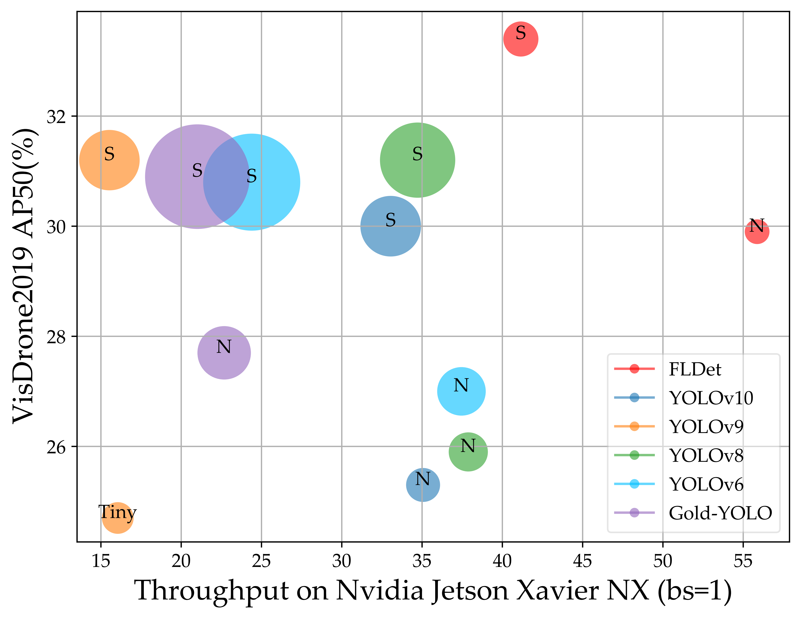

# FLDet: A Faster and Lighter Aerial Object Detector

<p align="center">
    
</p>


## Benchmark

### VisDrone2019

| Model   | Size | AP(%) | AP50(%) | #Params. | FLOPs | Latency | FPS  | Weight&train.log                                             |
| :-----: | :--: | :---: |:--------:| :---------: | :------: | :---------: | :--: | :----------------------------------------------------------: |
| FLDet-N | 640  | 16.7  | 30.1     | 1.2M        | 12.3G    | 17.9ms      | 55.9 | [Google Drive](https://drive.google.com/drive/folders/1BXsWjUddzvDL89Gw69CoPNBfCrCxNsb1?usp=sharing) |
| FLDet-S | 640  | 18.8  | 33.4     | 2.4M        | 26.9G    | 24.3ms      | 41.2 | [Google Drive](https://drive.google.com/drive/folders/1ktOuLqjgbrIYhcZ11jFlvhy_FGlm4lwj?usp=sharing) |

### UAVDT

|  Model  | Size | AP(%) | AP50(%) | #Params. | FLOPs | Latency | FPS  |                       Weight&train.log                       |
| :-----: | :--: | :---: | :-----: | :------: | :---: | :-----: | :--: | :----------------------------------------------------------: |
| FLDet-N | 640  | 16.8  |  28.8   |   1.2M   | 12.3G | 17.8ms  | 56.2 | [Google Drive](https://drive.google.com/drive/folders/1jGn8HVI6jfGbfvjtZ1pzlE2P4RoAEMcB?usp=sharing) |
| FLDet-S | 640  | 17.5  |  30.3   |   2.4M   | 26.9G | 24.2ms  | 41.3 | [Google Drive](https://drive.google.com/drive/folders/1rwlBxh4RCH48dbJw4Uwil8ePuj-YQ5vt?usp=sharing) |


## Code

The repo is the official implementation of FLDet.

Our config file is at [ultralytics/cfg/models/FLDet](ultralytics/cfg/models/FLDet)


## Requirement

1. Install [torch 2.0.1 and torchvision 0.15.2](https://pytorch.org/)

```shell
pip install torch==2.0.1 torchvision==0.15.2 --index-url https://download.pytorch.org/whl/cu118
```

2. Install other requirements

```shell
pip install -e .
```


## Usage

### Data preparation

You could download dataset form [VisDrone(YOLO Format)](https://pan.baidu.com/s/1xWKSZrib3FEBM8R9yY-2Rw?pwd=ry6x ) and [UAVDT dataset (YOLO Format)](https://pan.baidu.com/s/14PREuNKf0gVQFjdKUJV-TA?pwd=sf4x) .

### Training

#### 1. VisDrone2019

```shell
% FLDet-N
yolo detect train data=VisDrone_test.yaml model=FLDet-N.yaml imgsz=640 device=0,1,2,3 optimizer=SGD batch=32 lr0=0.02 name=test_VisDrone_FLDet-N patience=0 epochs=300 save_json=True mosaic=1.0 copy_paste=1.0 mixup=1.0 close_mixup=225 close_mosaic=150 close_copy_paste=75 decay_aug=True > test_VisDrone_FLDet-N.log 2>&1 &

% FLDet-S
yolo detect train data=VisDrone_test.yaml model=FLDet-S.yaml imgsz=640 device=0,1,2,3 optimizer=SGD batch=32 lr0=0.02 name=test_VisDrone_FLDet-S patience=0 epochs=300 save_json=True mosaic=1.0 copy_paste=1.0 mixup=1.0 close_mixup=225 close_mosaic=150 close_copy_paste=75 decay_aug=True > test_VisDrone_FLDet-S.log 2>&1 &
```

More super parameters about training please refer to  [Ultralytics YOLOv8 Docs](https://docs.ultralytics.com/).

#### 2. UAVDT

```shell
% FLDet-N
yolo detect train data=UAVDT.yaml model=FLDet-N.yaml imgsz=640 device=0,1,2,3 optimizer=SGD lr0=0.08 name=test_UAVDT_FLDet-N epochs=100 batch=32 save_json=True decay_aug=True mosaic=1.0 copy_paste=1.0 mixup=1.0 close_mixup=75 close_mosaic=50 close_copy_paste=25 > test_UAVDT_FLDet-N.log 2>&1 &

% FLDet-S
yolo detect train data=UAVDT.yaml model=FLDet-S.yaml imgsz=640 device=0,1,2,3 optimizer=SGD lr0=0.08 name=test_UAVDT_FLDet-S epochs=100 batch=32 save_json=True decay_aug=True mosaic=1.0 copy_paste=1.0 mixup=1.0 close_mixup=75 close_mosaic=50 close_copy_paste=25 > test_UAVDT_FLDet-S.log 2>&1 &
```

### Evaluation

```shell
yolo detect val data=/path/to/data.yaml model=/path/to/your/best.pt testspeed=False save_json=True name=your-work-dir half=True > val.log 2>&1 &
```
